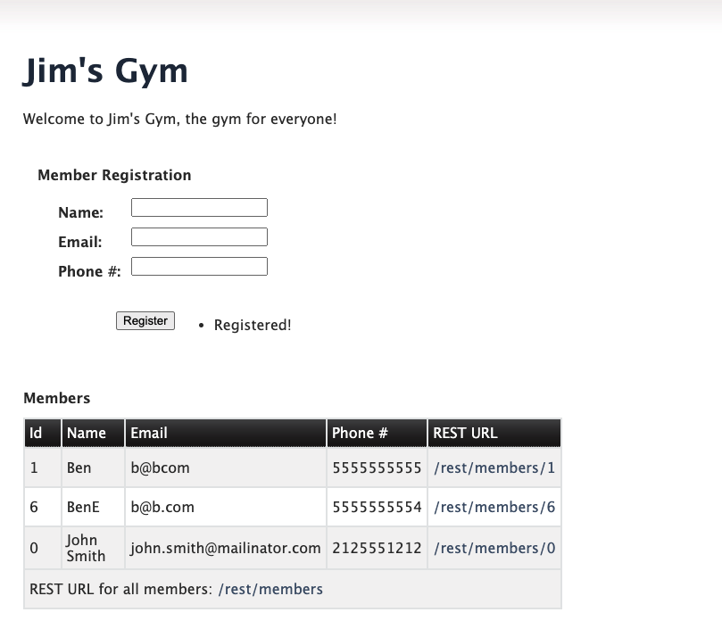

# jboss-breakdown-monolith
An example of splitting the monolith to allow independence between layers in deployment and scaling


This project has started with the JBoss 7.4 kitchensink quickstart and sought to split the web and ejb components. 

The are independently deployable EAR files and the web component uses http remoting to lookup EJBs on localhost:8080 as
a default.

The intention is to demonstrate Red Hat Application Interconnect in how a monolith running in a VM can be split in components with those components being able to be redeployed where needed.

There is work left to do in paramertising values and containerising for OpenShift.




To demonstrate it running it on EAP servers in a VM the following steps are required.

1. Download EAP 7.4 and unzip twice into different directories
https://developers.redhat.com/products/eap/download

You should now have 2 places where this is unzipped like so
/jboss-eap-7.4-2/
/jboss-eap-7.4/

2. For Server 2 (Backend) - JBoss server we will need to setup some configuration 

a. Postgres Driver
In the jboss-eap-7.4/bin directory
wget https://jdbc.postgresql.org/download/postgresql-42.5.0.jar

Start the server in the background
./standalone.sh &

Invoke the CLI and connect to the management console and add the postgressql module and datasource driver

./jboss-cli.sh --connect

module add --name=org.postgresql --resources=postgresql-42.5.0.jar --dependencies=javax.api,javax.transaction.api
/subsystem=datasources/jdbc-driver=postgres:add(driver-name=postgresql,driver-module-name=org.postgresql,driver-xa-datasource-class-name=org.postgresql.xa.PGXADataSource)


Now shutdown the server and exit from the CLI
shutdown
exit

b. For Server 2 - Postgres Datasource
The following needs to be added to standalone.xml after the datasources 

```xml

<subsystem xmlns="urn:jboss:domain:datasources:6.0">
<datasources>


<datasource jndi-name="java:jboss/datasources/KitchensinkEarQuickstartPGDS" pool-name="kitchensink-quickstartpg" enabled="true" use-java-context="true">
                    <connection-url>jdbc:postgresql://localhost:5432/postgresdb</connection-url>
                    <driver>postgresql</driver>
                    <security>
                        <user-name>postgres</user-name>
                        <password>mypassword123</password>
                    </security>
                </datasource>"

```

Run a containerised postgres on the VM matching the values in the datasource like so
docker run --rm=true --name pgdb -e POSTGRES_USER=postgres -e POSTGRES_PASSWORD=mypassword123 -e POSTGRES_DB=postgresdb -p 5432:5432 postgres

You can now verify it works by starting up JBoss in the foreground like so and see if any errors
/bin/standalone.sh 

Stop JBOSS

3. Now you can deploy the applications, for convenience the ear files have been checked into project, but otherwise to build it 
use Java 8 and install Maven
mvn clean install

Copy the ear files to the standalone/deployments directory

For server 1 deploy the kitchensink-ear-remote (this contains the frontend)
For server 2 deploy the kitchensink-ear (this contains the EJB and backend and will need the database/datasource setup)

4. Start the postgres database on localhost via docker or otherwise

5. Start server 2
./standalone.sh


6. Start server 1 with an offset
./standalone.sh -Djboss.socket.binding.port-offset=100 &

7. Navigate to the frontend 

http://localhost:8180/kitchensink-ear-web


(To remember to adjust for JBOSS for environment variables)
/subsystem=ee:write-attribute(name=jboss-descriptor-property-replacement,value=true)
/subsystem=ee:write-attribute(name=spec-descriptor-property-replacement,value=true)

   
   
