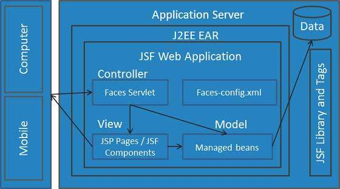
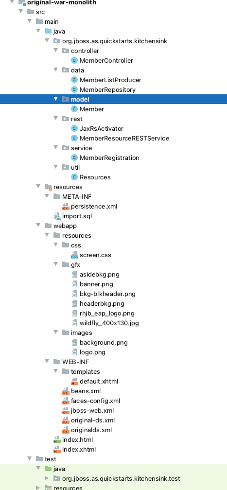

# Demo Script

## Part 1
The demonstration starts with a tour of the Java monolith.

The application in this instance represents how Java monoliths have been typically developed and packaged:
- Frontend Technology: HTML, CSS and JSF, Templates
- Controllers to help direct the flow of the application
- Model beans to represent the data
- Service beans helping to query the database
- Persistence Frameworks - Hibernate in this instance to map SQL to the Model
- API frameworks - JaxRS is helping to provide rest interfaces for direct calls from the UI or other systems
- Making use of out of the box Application Server Components - i.e. HTTP/S, Threading models, Datasources

This is a JSF based application which has been restricted to a single screen and managed beans are invoked to provide the model.
The "Data" in this case is the backend layer which is providing a means to register and retrieve registrations for Home Loan contacts.

The screenshot below demonstrates how code is within java packages and in the standard directory format that Maven works with.

Monoliths have advantage in that it easy to wire and inject services via CDI or Spring Beans together and everything will work. However it is not until we reach a problems such as: scaling work across people/teams or changing database structures affecting the rest of the code.

You can see the injection into the MemberController & MemberResourceRESTService with a nominal backend function to work with a data/persistence layer
  @Inject
  private MemberRegistration memberRegistration;
  
  @Inject
  private MemberRepository repository;
      
This is a key dependency that results in a coupled structure with backend and frontends.

## Part 2
The next phase of the demonstration is to refactor the monolith and take out the frontend into a container.

So what is the best way to break down this monolith? 

### Developer separates into Modules
The most obvious is the data services layer responsible for retrieving and updating members for Home Loan contacts.
We have chosen to use EJB Enterprise Java Beans as this will allow us a measured refactoring process given we can first refactor the monolith to have different modules but still be in a single deployable EAR file. 
This is typically done with BAU work with a Developer and will not require any significant changes to pipelines or deployments.

The intermediate step is highlighted in the project "modular". This splits the backend as an ejb project and the frontend as a web project. The "ear" project bundles the ejb and war into a single deployable ear file.

As with the original-war-monolith project we have a monolith but its properly split into its functional areas and breaks some dependencies between the UI and the backend. 
However there is still the wiring and dependencies between classes as highlighted in part 1.

### Developers/DevOps build Independent Builds and Pipelines

The final refactoring to ensure independence of builds requires a little bit of knowledge and work to 
1. Ensure the Java bean dependencies between backend and frontend are maintainable. This is achieved with producing an ejb-client jar.
2. Configure the EJBs to be accssible remotely, thus an interface class needs to be created as well (as below)

@Stateless
@Remote(MemberRepositoryIF.class)
@Transactional(Transactional.TxType.REQUIRED)
public class MemberRepository implements MemberRepositoryIF {

@Stateless
@Remote(MemberRegistrationIF.class)
@Transactional(Transactional.TxType.REQUIRED)

3. The Frontend classes can no  longer simply inject and wire the backend services, so a remote lookup code is needed. This is standard and also requires a 
user and password to be created in the JBoss server. The returned class matches in the interface.

public static MemberRegistrationIF lookupMemberRegistration() throws NamingException {
  ....
  jndiProperties.put(Context.INITIAL_CONTEXT_FACTORY, "org.wildfly.naming.client.WildFlyInitialContextFactory");
  ....
  return (MemberRegistrationIF) context.lookup(MemberRegistrationIF_EJB_LOOKUP);
}

4. Maven EAR projects were created for the backend and frontend.

The frontend and backend EAR files can now exist in the same or separate JBOSS EAP servers.

## Part 3
Now we have the monolithic application and the refactored front end. The monolith may still have the front end as part of it (**TODO: Need to discuss with Ben**), but now we want to deploy the front end on OpenShift.

The high-level steps will be:
1. Launch the monolithic application & database (if not already runnning)
2. Create a namespace on the on-premises OpenShift
3. Deploy Application Interconnect into the namespace
4. Deploy an Application Interconnect gateway on the same machine as the monolith
5. Expose the monolith on the RHAI Gateway
6. Deploy the Frontend to OpenShift
7. Demonstrate the applicaytion working from the monolith and via OpenShift.

### Set up the On-Premises OpenShift Environment
